# Luồng kiến trúc và cây tác vụ — paper/research

Checkpoint đối chiếu: `main` tại `fe1c1330d913e78239db575ff8433cf069fe1b01` (2026-09-27). Đây là bản đồ code hiện có, **không phải** tuyên bố nghiệm thu Stage 6–11, G2/G3/G4/G5 hay hiệu quả kinh tế. Không tìm thấy file nguồn của cây/sơ đồ nêu trong yêu cầu trong repository; vì vậy Mermaid dưới đây là nguồn chỉnh sửa được. Nếu sơ đồ gốc nằm ngoài Git, cần đối chiếu thủ công trước khi thay nó.

## Đối chiếu sáu quan hệ

| Quan hệ | Sơ đồ được mô tả trong yêu cầu | Code thực tế tại checkpoint | Spec/ADR áp dụng | Kết luận |
| --- | --- | --- | --- | --- |
| Logger → metrics/report | Report Generator ghi vào Trade Logger; đề xuất Logger làm nguồn cho metrics | `BacktestEngine.run` lấy `calculate_backtest_metrics` từ broker sau `finalize` (`src/backtest/engine.py`); `ReportGenerator.generate_all` nhận metrics + broker, gọi `TradeLogger.log_backtest_run`, rồi xuất summary/JSON/CSV/PNG/Markdown (`src/report/generator.py`). JSON trade xuất từ SQLite logger; metrics không đọc ngược logger. | ADR 0009 yêu cầu logger/report **sau** mô phỏng, zero semantic drift, metrics là một nguồn tính toán và SQLite lưu bản ghi. | **Lỗi sơ đồ về data flow**, không phải lỗi code. Mũi tên điều phối `ReportGenerator → TradeLogger` là đúng, nhưng mũi tên dữ liệu `broker → metrics → report` và `broker → logger → trades.json` phải được vẽ riêng. Không đổi logger thành đầu vào tính metrics vì trái ADR hiện tại. |
| Sizing/invariants/risk trước broker admission | Broker gọi sizing “sau gửi lệnh” | `submit_order` chỉ xếp `OrderRequest` ở trạng thái `PENDING`; tại `process_candle` open nến kế tiếp, broker tính fill/slippage, sizing, liquidation, `check_all_invariants` với breaker/news/margin rồi mới trừ fee và tạo `Position` (`src/execution/paper_broker.py`). | ADR 0007 pha 3 quy định chính thứ tự này; request từ close nến trước, không phải executed order. | **Lỗi nhãn/thứ tự sơ đồ** nếu “gửi” bị hiểu là “khớp”. Phân biệt request queued với entry admitted/filled. Không dời sizing lên signal close vì chưa biết next-open fill. |
| Order Models/Invariants | Hai node rời luồng chính | Trend/Breakout/SMC và PPO tạo `OrderRequest`; model kiểm tra loại/giá/stop. `BacktestEngine`/RL gọi `PaperBroker.submit_order`; broker pha 3 gọi invariants trước mutation. Funding basket không dùng `OrderRequest` nhưng có basket ledger + `check_all_invariants` trước atomic spot/perp entry (`src/strategies/funding_arbitrage.py`). | ADR 0007, 0010, 0011; spot inventory không phải isolated-futures `Position`. | **Lỗi sơ đồ**: nối model và invariant vào đường directional/RL; vẽ funding adapter riêng. Không đồng nhất basket với single-leg broker model. Đường exit/protective stop do broker quản lý, không đi qua entry gate lần nữa. |
| Market data → causal feature | Năm node data/features không rõ dây nối | `run_backtest.py` dùng cache Parquet hoặc `fetch_all` (`src/data_layer/fetcher.py`); Vision downloader cấp historical OI khi cần; merge OHLCV/OI/funding; `add_all_features` tính indicators/OI/CVD; engine duyệt nến theo UTC, chỉ chuyển slow-bar history đã đóng; news CSV đi vào risk gate, không thành price feature. | Master Spec data/no-lookahead, ADR 0001/0003/0007/0011 và charter §3: nguồn, event/source/availability time, exact funding readiness, không backdate. | **Thiếu sơ đồ và tiêu chí dữ liệu**, chưa chứng minh được lỗi code mới từ audit này. Cache hợp lệ không tự chứng minh availability của mọi nguồn; raw/source hash và trường thiếu phải được kiểm ở từng run. Test future perturbation và funding fail-closed vẫn là gate, không suy ra từ sơ đồ. |
| Research/funding/RL boundary | Research nối trực tiếp backtest chính | `run_comparison` tạo engine/broker/account mới cho mỗi fold và gọi funded-basket simulator riêng; `RiskAwareTradingEnv` gọi PaperBroker, scaler fit train; `train_ppo` chia train/validation/holdout và lưu model/report (`src/research/workflow.py`, `rl_env.py`). | ADR 0010/0011 và charter §2–5: bốn tài khoản độc lập, frozen candidate, chronological holdout; nghiên cứu không tự động promote policy vào G5. | **Thiếu ranh giới trong sơ đồ**. Report nghiên cứu là output, không có mũi tên tự động đưa model/tín hiệu vào live paper session. Việc chọn/promote cần validation và quyết định owner ở gate tiếp theo. |
| Web Offline Replay/Evidence | Web có replay và evidence | Trước sửa, `web-preview/src/lib/replay.js` cộng 12 delta tự đặt; bảng evidence chép số thủ công, trộn G2 2026 với fold 2024. Sau sửa, chart đọc bản sao đối chiếu nội dung của G0 synthetic broker `equity_curve.csv`, bảng 2024 lấy `walk_forward.report.json`, source/hash lấy manifest/audit JSON, G2 2026 được gắn nguồn riêng. Browser chỉ hiển thị, không thực thi engine. | Charter §2/5, preview contract 2026-09-25: phân biệt synthetic, public sample, author report và nghiệm thu; không tạo performance evidence giả. | **Lỗi code web đã sửa**; bản sao artifact được kiểm khớp nguồn trong Vitest. Static preview vẫn không phải live replay hay xác minh độc lập; báo cáo G2 nguồn narrative chưa có JSON coverage cùng revision. |

## Sơ đồ luồng — mũi tên dữ liệu và thời điểm thực thi

```mermaid
flowchart LR
  subgraph MD[Market Data]
    BP[Binance public API] --> MF[Market Fetcher]
    BV[Binance Vision archives] --> VD[Vision Downloader / OI]
    VD --> MF
    MF <--> PC[Parquet Cache]
    MF --> IC[Integrity + UTC/availability check]
    PC --> IC
    IC --> FP[Feature Pipeline: indicators / OI / CVD]
    NC[News Calendar CSV] --> NG[News gate]
  end
  subgraph TS[Trading Simulation — directional]
    FP --> BE[Backtest Engine: closed-bar clock]
    BE --> ST[Trend / Breakout / SMC strategy]
    ST --> OM[OrderRequest model: type + stop validation]
    OM --> Q[PaperBroker pending request]
    Q --> OP[Next candle open + slippage]
    OP --> PS[Position sizing + liquidation]
    PS --> RI[Order invariants + margin + news + circuit breaker]
    NG --> RI
    RI -->|admit only| PB[PaperBroker fill / positions / fees / funding / exits]
    RI -->|reject| OR[Order rejection record]
    PB --> LED[Orders / trades / funding / account snapshots]
    OR --> LED
  end
  subgraph RS[Research — isolated boundary]
    IC --> WF[Walk-forward: new account per fold]
    WF --> BE
    IC --> FA[Funding basket adapter: spot + perp]
    NG --> FA
    FA --> BRI[Basket risk + atomic two-leg admission]
    BRI --> BL[Separate basket ledger]
    IC --> RL[Gymnasium / PPO train-only scaler]
    RL --> OM
    WF --> VAL[Validation / OOS report; no auto-promotion]
    BL --> VAL
    RL --> VAL
  end
  subgraph RP[Reporting — after simulation]
    LED --> MET[Performance metrics from broker ledger]
    LED --> TL[Trade Logger: SQLite event store]
    MET --> RG[Report Generator orchestrator]
    TL --> RG
    BL --> RA[Basket / research artifact store]
    VAL --> RA
    RG --> ART[Summary JSON/MD, trades JSON, CSV, PNG, SQLite]
  end
  subgraph WEB[Read-only Web Preview]
    ART -->|committed synthetic CSV copy| WR[Offline artifact viewer]
    RA -->|committed report/manifest copies| WE[Evidence panels]
    WR --> UI[Static PAPER/RESEARCH app]
    WE --> UI
  end
```

Chú ý: `ReportGenerator → TradeLogger` là lời gọi **ghi**; `TradeLogger → ReportGenerator` ở sơ đồ là dữ liệu persisted để xuất `trades.json`. Chart web không tự sinh lệnh, số dư hoặc PnL. `News Calendar` mặc định disabled; nếu bật mà calendar hỏng/thiếu thì risk gate fail-closed. Funding adapter được phép là nhánh riêng theo ADR 0011, không đại diện cho broker futures một chân.

## Cây tác vụ phụ thuộc, đầu ra và tiêu chí hoàn thành

Các hàng dưới là **tiêu chí phải chứng minh khi nghiệm thu**, không phải checkbox đã pass. Một test kỹ thuật pass không phải economic validation. Thứ tự phụ thuộc từ trên xuống; những nhánh song song chỉ mở sau input gate tương ứng.

| Nhóm / thứ tự | Phụ thuộc và việc chính | Đầu ra bắt buộc | Tiêu chí hoàn thành / owner gate |
| --- | --- | --- | --- |
| 1. Market Data | Public API + Vision → immutable raw/hash → Parquet cache → integrity/UTC/availability → features; news calendar đi riêng vào risk. | Manifest venue, spot/perp, timeframe, UTC source/event/available/collected time, raw + normalized SHA, gaps/duplicates/revisions; causal feature dataset. | Cache-hit và fetch có cùng identity; incomplete/stale/future source fail-closed; no-lookahead future perturbation không đổi signal cũ; exact funding readiness, news-disabled và enabled-bad-calendar đều được test. Thiếu nguồn thật ghi `NOT_VERIFIED`. |
| 2. Trading Simulation | Sau 1: closed bar → OrderRequest → pending → next-open fill estimate → sizing + invariant/news/breaker gate → broker accounting. | Order state/rejection ledger, position/funding ledger, account snapshots, deterministic backtest artifact. | Mọi LONG/SHORT/RL entry đi qua stop, max leverage 5×, size/margin/liquidation/breaker; basket spot+perp đi qua gate riêng atomic. Test fee, slippage, funding source/idempotency, collateral, force-close, SL/TP conservative ordering, no same-bar impossible profit, rejected order không trừ tiền; final equity reconcile. |
| 3. Research | Sau 1–2: bốn tài khoản riêng/fold; funding basket ledger; PPO train-only scaler; frozen candidate. | Walk-forward partitions/manifest, rulebook+config/model/scaler hashes, holdout và replay reports riêng. | UTC strict/non-overlap; không fit/select trên holdout; fold reset state/capital; replay deterministic; basket source và two-leg accounting đối soát; PPO save/load/evaluate qua broker; không tự đưa kết quả vào G5. Independent Tester/Reviewer và owner mới chốt gate. |
| 4. Reporting | Sau 2–3: broker ledger → metrics + Trade Logger → report/artifacts. | SQLite, JSON, CSV, PNG, Markdown cùng run/config/data identity; basket schema riêng. | Atomic/idempotent conflict detection; metrics whole-position và realization slices tách; zero-trade hợp lệ; checksum/portable path; sample_unit, net fees/funding/PnL và breaker/margin rejection phân biệt; cùng input/config/seed tái lập. |
| 5. Web Preview | Sau artifact 4: copy/verify committed evidence → static read-only viewer. | Static app với source links, as-of, artifact/chart, risk/accounting labels và trạng thái bằng chứng. | Chart khớp nội dung CSV nguồn sau chuẩn hóa line ending, số bảng khớp JSON nguồn trong test; synthetic không gắn thành public PnL; G2 2026 không trộn fold 2024; build/browser smoke; không secret, order API, live/testnet endpoint hoặc claim sinh lời. Preview deployment không đồng nghĩa G0–G5 hay economic acceptance. |

**Gate còn mở:** Stage 6–11 và G2 vẫn chờ Tester/Independent Reviewer; canonical 2021-01-01→2026-09-01, untouched OOS dài hạn và G5 prospective paper chưa được nghiệm thu. Có sẵn code path hoặc sơ đồ đúng không thay cho artifact/run độc lập. Nếu source funding millisecond-late cần policy mới, owner/PM phải quyết định trước khi sửa ADR 0011.
